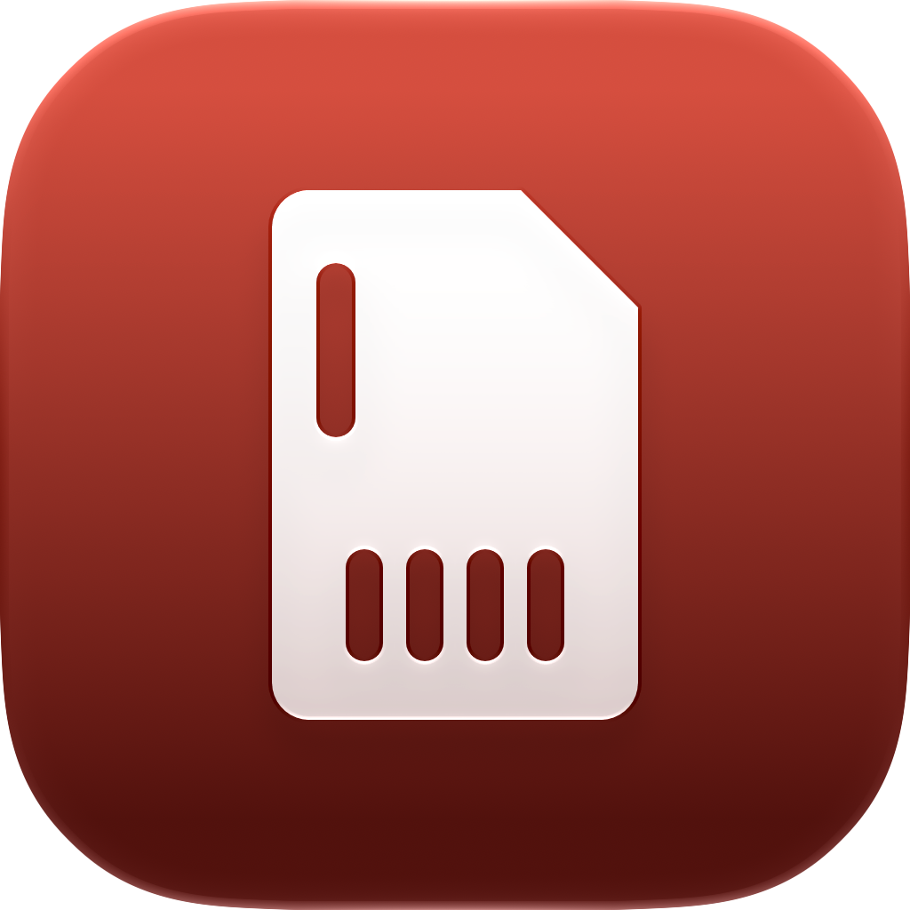

<div align="center">



# Media Shuttle

**A native camera-card ingest app for macOS and Windows that proves every original arrived safely.**

[](#macos)
[](#windows)
[](#build-from-source)
[](#build-from-source)
[](LICENSE)
[](https://github.com/AdamNolle/media-shuttle/releases)

Connect a card. Media Shuttle sorts every photo and video, verifies both sides with SHA-256,
and unlocks erase only when the card still matches that verified transfer.


</div>

## Why Media Shuttle

A completed copy is not the same as a safe copy. Media Shuttle writes each file through a uniquely
named partial file, hashes the bytes read from the card, independently hashes the destination, and
publishes the final file only when both SHA-256 digests match.

The result is organized automatically:

```text
Camera/
├── Photos/
│   ├── JPEGs/
│   ├── RAWs/
│   └── Other/
└── Videos/
```

The default destination is `~/Desktop/Camera`. Choose any accessible folder and Media Shuttle will
remember it.

## Two native apps, one behaviour

Media Shuttle ships a separate native app per platform. They share no runtime, but implement the
same verified-ingest and safe-erase rules described below, and use the same on-disk layout. One
difference matters today: see the platform note under [Supported media](#supported-media).

| | macOS | Windows |
| --- | --- | --- |
| Source | `macos/` | `windows/` |
| Built with | SwiftUI, Swift 6 | WinUI 3, .NET 8 |
| Requires | macOS 14 Sonoma or newer | Windows 10 1809 or newer |
| Background presence | Menu bar extra | System tray icon |
| Start with the OS | Login Items (`SMAppService`) | Startup registration |

Shared across both:

- Automatic camera-card discovery across mounted removable and external volumes.
- Status and controls while the main window is closed.
- Native notifications for completed transfers and erases.
- Optional automatic transfer when a new card is mounted.
- Optional `YYYY-MM-DD` folders within each media category.
- No telemetry, account, cloud service, or Electron runtime.

## Verified ingest

Media Shuttle:

1. scans camera layouts rooted at `DCIM`, `M4ROOT`, or `PRIVATE`;
2. sorts each supported file by media type;
3. writes new data to a `.partial-<unique-id>` file;
4. calculates SHA-256 while reading the source;
5. independently hashes the completed destination file;
6. atomically publishes the verified file and records the transfer session.

Existing files are hashed rather than copied again when their size and content already match. A
name collision with different content is preserved using numbered names such as `DSC0001 (2).JPG`.
A changing source, incomplete scan, unsafe destination, missing destination, or hash mismatch stops
the operation without presenting a partial file as complete.

## Safe card erase

Erase remains locked until a completed session matches the connected volume, its current media
inventory, and every recorded destination file. Immediately before deletion, Media Shuttle again:

1. confirms the card root and stable volume identity;
2. refuses any card holding a file it does not recognize;
3. rescans the complete media inventory;
4. rejects added, missing, resized, or unrecorded media;
5. recalculates SHA-256 for every source and destination copy;
6. starts deletion only after every digest matches the verified session.

Step 2 fails closed. A transfer only copies files Media Shuttle classifies as camera media, so
anything else on the card has no destination copy to verify against — and deleting it would lose it
for good. Erase therefore refuses the whole card unless every file on it is either recognized media
or camera and operating-system housekeeping such as `THM` thumbnails, `XML` clip metadata, `AVCHD`
index files, and `.DS_Store`. When something unrecognized is present, the app names it and leaves
erase locked; copy those files off the card yourself, then erase.

Confirmation requires both an acknowledgment checkbox and the exact phrase `ERASE EVERYTHING`.
Media Shuttle then removes all user content, including camera databases and sidecar folders, and
performs a final scan. System-managed volume folders such as `.Spotlight-V100`, `.Trashes`,
`.fseventsd`, `$RECYCLE.BIN`, and `System Volume Information` may remain or be recreated by the
operating system.

This is a file-level erase, not a filesystem format. Use the camera’s own **Format** command when a
freshly initialized camera filesystem is required.

## Supported media

| Category | Extensions |
| --- | --- |
| JPEG | `JPG`, `JPEG`, `JPE` |
| RAW | `ARW`, `SR2`, `SRF`, `DNG`, `RAW`, `CR2`, `CR3`, `CRW`, `NEF`, `NRW`, `RAF`, `ORF`, `RW2`, `RWL`, `PEF`, `PTX`, `SRW`, `X3F`, `3FR`, `FFF`, `IIQ`, `CAP`, `EIP`, `MEF`, `MOS`, `MRW`, `ERF`, `DCR`, `KDC`, `K25`, `GPR`, `ARI` |
| Other photos | `HEIF`, `HEIC`, `HIF`, `AVIF`, `JXL`, `TIF`, `TIFF`, `PNG`, `BMP`, `GIF`, `WEBP`, `JP2`, `J2K`, `PSD` |
| Video | `MP4`, `M4V`, `MOV`, `MXF`, `BRAW`, `R3D`, `MTS`, `M2TS`, `M2T`, `TS`, `MOD`, `TOD`, `AVI`, `MKV`, `WEBM`, `WMV`, `ASF`, `MPG`, `MPEG`, `M2V`, `VOB`, `3GP`, `3G2`, `INSV`, `LRV`, `DV` |

AppleDouble sidecars whose names begin with `._` are ignored during ingest. Symbolic links are never
followed while scanning or erasing a card.

> **Platform note.** The table above describes the Windows app as of 0.1.0. The macOS app currently
> recognizes only `ARW` and `DNG` as RAW, along with the shorter JPEG, other-photo, and video lists
> from earlier releases, and it does not yet apply the unrecognized-content rule described under
> [Safe card erase](#safe-card-erase). Until that is ported, do not rely on the macOS app's erase
> with a card holding formats it does not recognize.

## Install

Both platforms are published on the same tag in
[GitHub Releases](https://github.com/AdamNolle/media-shuttle/releases). Verify a download against
the matching `SHA256SUMS-macos.txt` or `SHA256SUMS-windows.txt`.

### macOS

Requires macOS 14 Sonoma or newer.

1. Download `MediaShuttle-v*-macOS-universal.dmg`.
2. Open the disk image and drag **Media Shuttle.app** into the **Applications** shortcut.
3. Open Media Shuttle, choose a destination, and connect a camera card.

Community builds are ad-hoc signed unless a release maintainer supplies a Developer ID certificate.
For an ad-hoc build, Control-click the app, choose **Open**, then confirm once in the macOS security
prompt.

### Windows

Requires Windows 10 1809 or newer.

1. Download `MediaShuttle-Setup-v*-win-x64.exe` and run it, or take
   `MediaShuttle-v*-win-x64.zip` for a portable copy.
2. Launch Media Shuttle, choose a destination, and connect a camera card.

The build is self-contained, so no .NET runtime install is required. Unsigned builds raise a
SmartScreen warning; choose **More info**, then **Run anyway**.

## Build from source

### macOS

Requires macOS 14 or newer and Xcode 16 or newer with Swift 6.

```bash
swift run --package-path macos MediaShuttle
```

Run the safety suite from a scratch directory outside cloud-synchronized folders:

```bash
swift test --package-path macos --scratch-path /tmp/media-shuttle-tests
```

Create an ad-hoc-signed universal Apple silicon and Intel disk image:

```bash
./macos/scripts/package-macos.sh 0.1.0
```

The app icon is authored in **Icon Composer** (`macos/Resources/MediaShuttle.icon`). After editing it
there, regenerate the iconset and `AppIcon.icns`:

```bash
./macos/scripts/build-icon.sh
```

The disk image is written to `macos/artifacts/` with a matching `SHA256SUMS-macos.txt`. Set
`CODE_SIGN_IDENTITY` to a Developer ID Application identity for a signed distribution.

### Windows

Requires the .NET 8 SDK, the Windows App SDK workload, and — for the installer — Inno Setup 6
(`winget install JRSoftware.InnoSetup`). Run from the repository root:

```powershell
.\windows\build.ps1 -Clean
```

`build.ps1` runs the core test suite, publishes a self-contained `win-x64` build, packages a
portable zip and an Inno Setup installer into `windows/artifacts/`, and writes
`SHA256SUMS-windows.txt`. Use `-SkipInstaller` for a portable-only build, or `-SkipTests` to skip
the suite.

To build and install locally in one step:

```powershell
.\windows\install.ps1
```

### Releases

Both platforms key off the same `v*` tag. Pushing `v0.1.0` runs the macOS and Windows release
workflows, which each build, test, and attach their own artifacts to that GitHub Release. The
Windows workflow additionally checks that the tag matches `<Version>` in
`windows/src/MediaShuttle/MediaShuttle.csproj`, so bump that alongside the tag.

## Data and privacy

Settings, verified transfer records, and the activity log are stored locally in:

```text
macOS:    ~/Library/Application Support/Media Shuttle/
Windows:  %LOCALAPPDATA%\Media Shuttle\
```

Media Shuttle makes no network requests and collects no analytics.

## License

[MIT](LICENSE)
