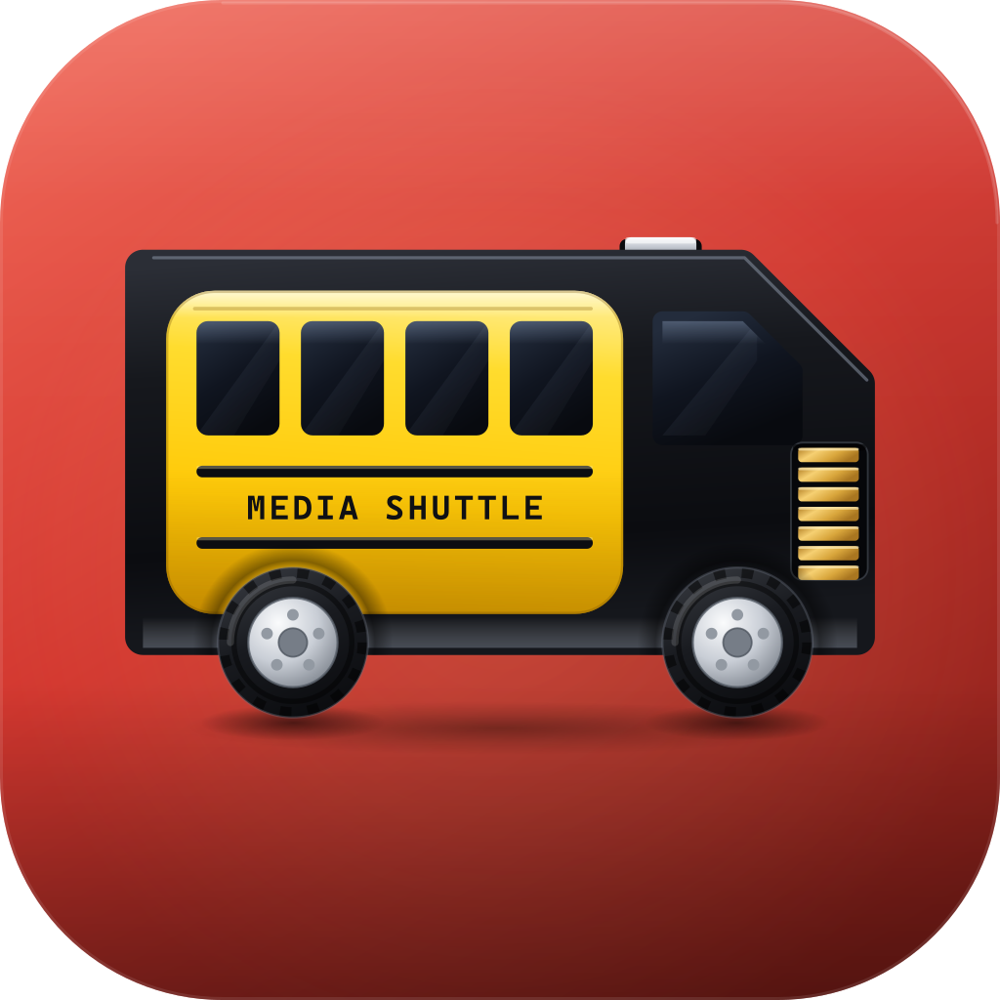

<div align="center">


<br>

**A completed copy is not the same as a safe copy.**

Media Shuttle sorts every photo and video off a camera card, verifies both sides with SHA-256,
and unlocks erase only while the card still matches that verified transfer.

<br>

[](#macos)
[](#windows)
[](#macos-1)
[](#windows-1)
[](#data-and-privacy)
[](LICENSE)
[](https://github.com/AdamNolle/media-shuttle/releases)

<br>


</div>

---

## How it works

```text
   CARD                    MEDIA SHUTTLE                        DESTINATION
   ────                    ─────────────                        ───────────
   DSC0001.ARW    ──▶   scan · sort · hash   ──▶   .partial-a1b2…  ──▶  Photos/RAWs/DSC0001.ARW
                          SHA-256 both sides            ▲                 ▲
                                                        │                 │
                          published only once both digests match ─────────┘
```

Each file is written through a uniquely named partial file. Media Shuttle hashes the bytes it reads
from the card, independently hashes the finished destination file, and publishes the result only
when both digests agree. A changing source, an incomplete scan, an unsafe or missing destination,
or a hash mismatch stops the operation — it never presents a partial file as complete.

Files already at the destination are hashed rather than copied again when their size and content
match. A name collision with *different* content is kept, as `DSC0001 (2).JPG`.

### Where things land

```text
Camera/
├── Photos/
│   ├── JPEGs/
│   ├── RAWs/
│   └── Other/
└── Videos/
```

A category folder is created when a transfer has something to put in it, so a card of nothing but
JPEGs leaves no empty `RAWs`, `Other`, or `Videos` folders behind. The default destination is
`~/Desktop/Camera`; choose any accessible folder and Media Shuttle remembers it. Optional
`YYYY-MM-DD` folders can be nested inside each category.

---

## Safe card erase

Erase stays locked until a completed session matches the connected volume, its current media
inventory, **and** every recorded destination file. Immediately before deleting anything, Media
Shuttle checks all of it again:

| | Check |
| :--: | --- |
| 1 | Confirms the card root and its stable volume identity |
| 2 | **Refuses any card holding a file it does not recognize** |
| 3 | Rescans the complete media inventory |
| 4 | Rejects added, missing, resized, or unrecorded media |
| 5 | Recalculates SHA-256 for every source *and* destination copy |
| 6 | Begins deletion only once every digest matches the verified session |

> [!IMPORTANT]
> **Step 2 fails closed.** A transfer only copies files Media Shuttle classifies as camera media, so
> anything else on the card has no destination copy to verify against — and deleting it would lose
> it for good. Erase therefore refuses the whole card unless every file on it is either recognized
> media or camera and OS housekeeping (`THM` thumbnails, `XML` clip metadata, AVCHD index files,
> `.DS_Store`). When something unrecognized is present, the app names it and leaves erase locked.
> Copy those files off the card yourself, then erase.

Confirmation needs both an acknowledgment checkbox and the exact phrase `ERASE EVERYTHING`. Media
Shuttle then removes all user content — camera databases and sidecar folders included — and runs a
final scan. System-managed volume folders such as `.Spotlight-V100`, `.Trashes`, `.fseventsd`,
`$RECYCLE.BIN` and `System Volume Information` may remain or be recreated by the OS.

This is a file-level erase, not a filesystem format. Use the camera's own **Format** command when a
freshly initialized camera filesystem is what you need.

---

## Two native apps, one behaviour

A separate native app per platform. They share no runtime, but implement the same verified-ingest
and safe-erase rules and use the same on-disk layout.

| |  |  |
| --- | --- | --- |
| Source | `macos/` | `windows/` |
| Built with | SwiftUI, Swift 6 | WinUI 3, .NET 8 |
| Requires | macOS 14 Sonoma or newer | Windows 10 1809 or newer |
| Background presence | Menu bar extra | System tray icon |
| Start with the OS | Login Items (`SMAppService`) | Startup registration |

Shared across both: automatic card discovery across mounted removable and external volumes; status
and controls while the main window is closed; native notifications; optional automatic transfer on
card arrival; and **no telemetry, account, cloud service, or Electron runtime**.

---

## Supported media

Media Shuttle scans camera layouts rooted at `DCIM`, `M4ROOT`, or `PRIVATE`. Both apps read the same
table and apply the same unrecognized-content rule described under [Safe card erase](#safe-card-erase).

| Category | Extensions |
| --- | --- |
| **JPEG** | `JPG` `JPEG` `JPE` |
| **RAW** | `ARW` `SR2` `SRF` `DNG` `RAW` `CR2` `CR3` `CRW` `NEF` `NRW` `RAF` `ORF` `RW2` `RWL` `PEF` `PTX` `SRW` `X3F` `3FR` `FFF` `IIQ` `CAP` `EIP` `MEF` `MOS` `MRW` `ERF` `DCR` `KDC` `K25` `GPR` `ARI` |
| **Other photos** | `HEIF` `HEIC` `HIF` `AVIF` `JXL` `TIF` `TIFF` `PNG` `BMP` `GIF` `WEBP` `JP2` `J2K` `PSD` |
| **Video** | `MP4` `M4V` `MOV` `MXF` `BRAW` `R3D` `MTS` `M2TS` `M2T` `TS` `MOD` `TOD` `AVI` `MKV` `WEBM` `WMV` `ASF` `MPG` `MPEG` `M2V` `VOB` `3GP` `3G2` `INSV` `LRV` `DV` |

AppleDouble sidecars beginning with `._` are ignored during ingest. Symbolic links are never followed
while scanning or erasing a card.

---

## Install

Both platforms publish from the same tag in
[GitHub Releases](https://github.com/AdamNolle/media-shuttle/releases). Verify a download against the
matching `SHA256SUMS-macos.txt` or `SHA256SUMS-windows.txt`.

### macOS

1. Download `MediaShuttle-v*-macOS-universal.dmg`.
2. Open it and drag **Media Shuttle.app** into **Applications**.
3. Open the app, choose a destination, connect a card.

Community builds are ad-hoc signed unless a maintainer supplies a Developer ID certificate. For an
ad-hoc build, Control-click the app, choose **Open**, and confirm once.

### Windows

1. Download `MediaShuttle-Setup-v*-win-x64.exe`, or `MediaShuttle-v*-win-x64.zip` for a portable copy.
2. Launch it, choose a destination, connect a card.

Self-contained, so no .NET runtime install is needed. Unsigned builds raise SmartScreen: choose
**More info** → **Run anyway**.

---

## Build from source

<details>
<summary><b>macOS</b> — Xcode 16+ with Swift 6</summary>

<br>

```bash
swift run --package-path macos MediaShuttle
```

Run the safety suite from a scratch directory outside cloud-synchronized folders:

```bash
swift test --package-path macos --scratch-path /tmp/media-shuttle-tests
```

Build an ad-hoc-signed universal disk image into `macos/artifacts/`, with a matching
`SHA256SUMS-macos.txt`:

```bash
./macos/scripts/package-macos.sh 0.0.1
```

Set `CODE_SIGN_IDENTITY` to a Developer ID Application identity for signed distribution. The icon is
authored in **Icon Composer** (`macos/Resources/MediaShuttle.icon`); regenerate the iconset and
`AppIcon.icns` with `./macos/scripts/build-icon.sh`.

</details>

<details>
<summary><b>Windows</b> — .NET 8 SDK, Windows App SDK workload, Inno Setup 6 for the installer</summary>

<br>

```powershell
.\windows\build.ps1 -Clean
```

Runs the core test suite, publishes a self-contained `win-x64` build, and packages a portable zip
plus an Inno Setup installer into `windows/artifacts/` with `SHA256SUMS-windows.txt`. Use
`-SkipInstaller` for portable-only, or `-SkipTests` to skip the suite.

Build and install locally in one step:

```powershell
.\windows\install.ps1
```

</details>

<details>
<summary><b>Releases</b> — both platforms key off one tag</summary>

<br>

Pushing `v0.0.1` runs the macOS and Windows release workflows, which each build, test, and attach
their own artifacts to that GitHub Release. The Windows workflow additionally checks that the tag
matches `<Version>` in `windows/src/MediaShuttle/MediaShuttle.csproj`, so bump that alongside the tag.

</details>

---

## The logo

<div align="center">



</div>

An SD card drawn as a shuttle bus. The card's chamfered corner does double duty as the windshield
rake, and the driver's window repeats the same 45° cut — the one detail that makes the shape an SD
card is also what makes it a bus.

Three marks share one grid so nothing shifts at a size boundary: the full one above 96px, a
simplified one from 32 to 64, and a micro one at 16 to 24, where the whole bus is sixteen pixels
wide. Sources, the build scripts and a preview page live in [`docs/logo/`](docs/logo/).

---

## Data and privacy

Settings, verified transfer records, and the activity log are stored locally:

```text
macOS:    ~/Library/Application Support/Media Shuttle/
Windows:  %LOCALAPPDATA%\Media Shuttle\
```

Media Shuttle makes no network requests and collects no analytics.

---

<div align="center">

[MIT](LICENSE) · Built for people who would rather not lose a shoot.

</div>
