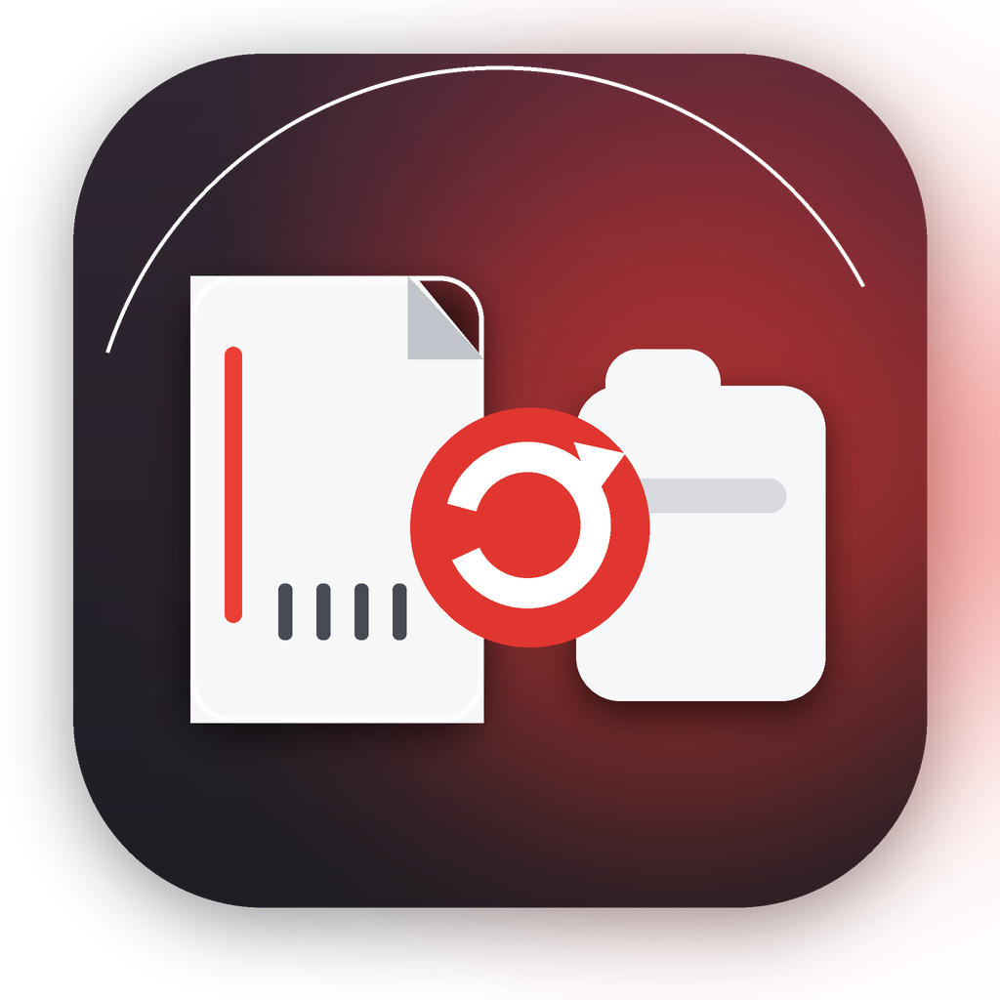
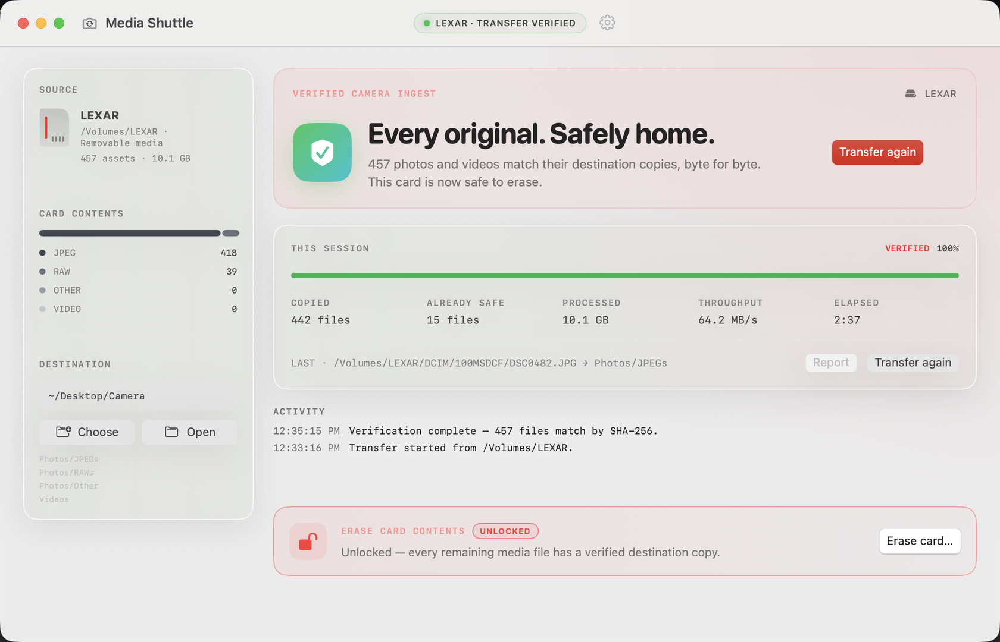

<div align="center">



# Media Shuttle

**A native macOS camera-card ingest app that proves every original arrived safely.**

[](#install)
[](#build-from-source)
[](LICENSE)
[](https://github.com/AdamNolle/media-shuttle/releases)

Connect a card. Media Shuttle sorts every photo and video, verifies both sides with SHA-256,
and unlocks erase only when the card still matches that verified transfer.



</div>

## Why Media Shuttle

A completed copy is not the same as a safe copy. Media Shuttle writes each file through a uniquely
named partial file, hashes the bytes read from the card, independently hashes the destination, and
publishes the final file only when both SHA-256 digests match.

The result is organized automatically:

```text
Camera/
├── Photos/
│   ├── JPEGs/
│   ├── RAWs/
│   └── Other/
└── Videos/
```

The default destination is `~/Desktop/Camera`. Choose any accessible folder and Media Shuttle will
remember it.

## Native macOS experience

- SwiftUI interface built for macOS 14 and newer, with System, Light, and Dark appearances.
- Automatic camera-card discovery across mounted removable and external volumes.
- Menu bar status and controls while the main window is closed.
- Launch at Login integration through macOS Login Items.
- Native notifications for completed transfers and erases.
- Optional automatic transfer when a new card is mounted.
- Optional `YYYY-MM-DD` folders within each media category.
- No telemetry, account, cloud service, Electron runtime, or .NET dependency.

## Verified ingest

Media Shuttle:

1. scans camera layouts rooted at `DCIM`, `M4ROOT`, or `PRIVATE`;
2. sorts each supported file by media type;
3. writes new data to a `.partial-<unique-id>` file;
4. calculates SHA-256 while reading the source;
5. independently hashes the completed destination file;
6. atomically publishes the verified file and records the transfer session.

Existing files are hashed rather than copied again when their size and content already match. A
name collision with different content is preserved using numbered names such as `DSC0001 (2).JPG`.
A changing source, incomplete scan, unsafe destination, missing destination, or hash mismatch stops
the operation without presenting a partial file as complete.

## Safe card erase

Erase remains locked until a completed session matches the connected volume, its current media
inventory, and every recorded destination file. Immediately before deletion, Media Shuttle again:

1. confirms the card root and stable volume identity;
2. rescans the complete media inventory;
3. rejects added, missing, resized, or unrecorded media;
4. recalculates SHA-256 for every source and destination copy;
5. starts deletion only after every digest matches the verified session.

Confirmation requires both an acknowledgment checkbox and the exact phrase `ERASE EVERYTHING`.
Media Shuttle then removes all user content, including camera databases and sidecar folders, and
performs a final scan. macOS-managed volume folders such as `.Spotlight-V100`, `.Trashes`, and
`.fseventsd` may remain or be recreated by the system.

This is a file-level erase, not a filesystem format. Use the camera’s own **Format** command when a
freshly initialized camera filesystem is required.

## Supported media

| Category | Extensions |
| --- | --- |
| JPEG | `JPG`, `JPEG` |
| RAW | `ARW`, `DNG` |
| Other photos | `HEIF`, `HEIC`, `HIF`, `TIF`, `TIFF`, `PNG` |
| Video | `MP4`, `MOV`, `MXF`, `MTS`, `M2TS`, `AVI` |

AppleDouble sidecars whose names begin with `._` are ignored during ingest. Symbolic links are never
followed while scanning or erasing a card.

## Install

Media Shuttle requires macOS 14 Sonoma or newer.

1. Download `MediaShuttle-v*-macOS-universal.zip` from
   [GitHub Releases](https://github.com/AdamNolle/media-shuttle/releases).
2. Unzip it and move **Media Shuttle.app** to `/Applications`.
3. Open Media Shuttle, choose a destination, and connect a camera card.

Community builds are ad-hoc signed unless a release maintainer supplies a Developer ID certificate.
For an ad-hoc build, Control-click the app, choose **Open**, then confirm once in the macOS security
prompt.

## Build from source

Requirements:

- macOS 14 or newer
- Xcode 16 or newer with Swift 6

Run the app directly:

```bash
swift run MediaShuttle
```

Run the safety suite from a scratch directory outside cloud-synchronized folders:

```bash
swift test --scratch-path /tmp/media-shuttle-tests
```

Create an ad-hoc-signed universal Apple silicon and Intel application archive:

```bash
./scripts/package-macos.sh 2.1.0
```

The package is written to `artifacts/` with a corresponding entry in `SHA256SUMS.txt`. Set
`CODE_SIGN_IDENTITY` to a Developer ID Application identity when producing a signed distribution.
Version tags such as `v2.1.0` run the macOS release workflow, execute the safety suite, package the
universal app, and attach both files to the GitHub Release.

## Data and privacy

Settings, verified transfer records, and the activity log are stored locally in:

```text
~/Library/Application Support/Media Shuttle/
```

Media Shuttle makes no network requests and collects no analytics.

## License

[MIT](LICENSE)
